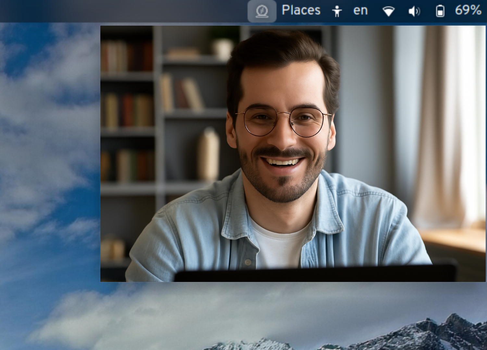
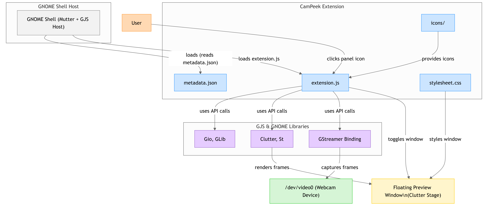

# CamPeek

  

🪞 **CamPeek** — Instant webcam preview for GNOME Shell (Linux alternative to macOS's Hand Mirror)  
> ⚠️ **Note:** CamPeek is compatible with **GNOME Shell 48 only**.

---

## 📸 What is CamPeek?

CamPeek gives you a **quick, floating webcam window** from your GNOME panel — like a mirror on your screen. Whether you're about to join a video call or want to check your lighting, CamPeek is a lightweight, privacy-conscious companion.

---

## ✨ Features

- 🖼️ Clean, borderless always-on-top preview  
- 🖱️ Single click to toggle webcam feed  
- 🔐 No recording or saving — live-only feed  
- 🐧 Designed for GNOME Shell on Linux

---

## 🖼️ Preview

---

## 📥 Install via GNOME Extensions

You can install CamPeek directly from the GNOME Extensions website:

---

## 🧪 How to Use

- Click the 🪞 CamPeek icon in the GNOME top bar
- A floating webcam preview will open — always on top
- Click again to close it

---

## ❓ FAQ

**Q: Does it record or save video?**  
**A:** 🔐 No. CamPeek is just a live mirror — nothing is saved.

**Q: Can I resize or move the window?**  
**A:** Not yet — this is planned for a future version! 🎯

---

## 👨‍💻 Contributing

Pull requests are welcome!  
Found a bug or have an idea? Open an issue or submit a PR.

---

## 📄 License

🧾 GPL-2.0-or-later

---

## ☕ Support

If you like this project, consider buying me a coffee:

Made with ❤️ by **Gamal Sherif**

---

